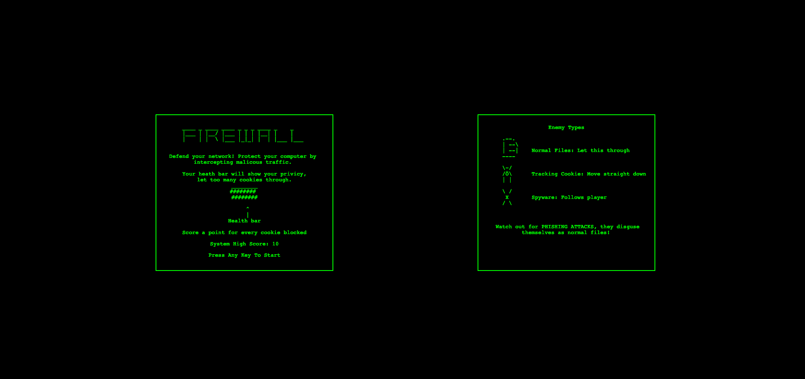
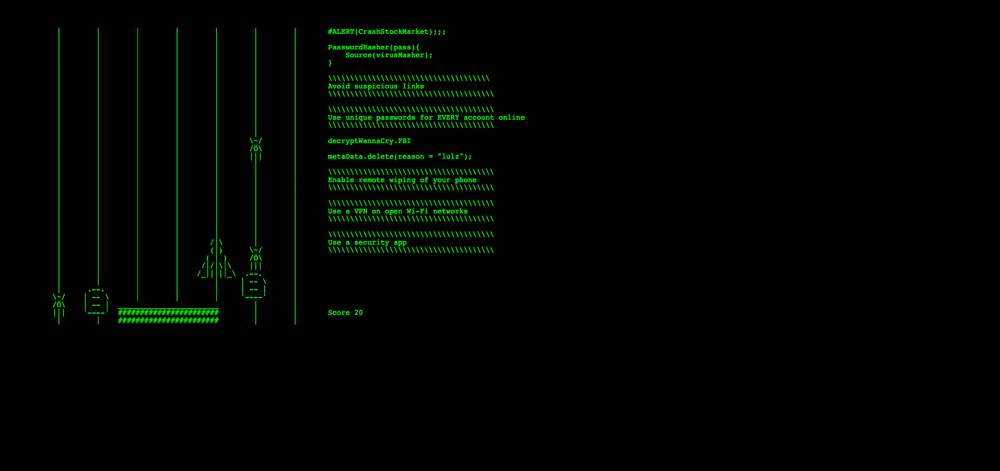
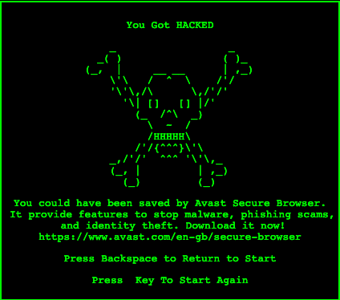

# firewall

Why using a game engine when you have text? Firewall is a tiny browser game in which the user has to block 
incoming viruses to protect the users computer. We built our own system for rendering text on the screen which works most of the time.

Other features include:
* Hacker text to immerse you in the experience
* Cool ASCII art
* Shameless promotion of Avast Secure Browser

Play it at [https://www.freddiejbawden.com/firewall/](https://www.freddiejbawden.com/firewall/). Headphone users turn your sound down!

_Build for the Avast Challenge at HackCambridge 2020_
